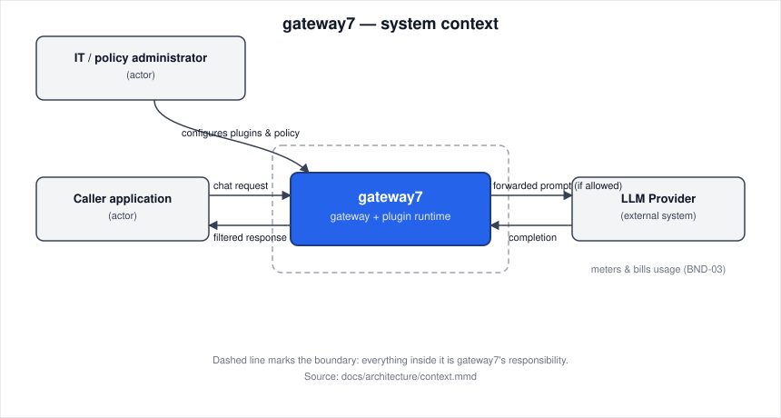

# Product vision

gateway7

## Goal

A corporate IT team can send its applications' chat requests through gateway7 to an LLM provider while a company-authored plugin applies an explicit mask, block, or allow decision to the request and the response before either leaves the team's control.

**Supports:** [VP-01](research/value-proposition.md#vp-01-predictable-local-preflight-for-small-teams), [VP-02](research/value-proposition.md#vp-02-testable-domain-filter-extensions).

## Stakeholders

- **Customer**: the corporate IT team piloting gateway7. Confirmed the plugin-host direction at the [October 2 kickoff](../reports/week-01/meeting-report.md#decisions) and decides the product's scope.
- **Caller application / its developer**: sends chat requests through gateway7 and receives its filtered response; the primary user of the running system.
- **IT / policy administrator**: operates gateway7, authors or installs the request and response plugins, and sets each plugin's policy action.
- **End user of the caller application**: affected without using gateway7 directly — their chat text is what a plugin may mask or block.
- **LLM provider**: affected without choosing the product — receives only the text the policy allows through, and meters its own usage.
- **gateway7 team (course team 7)**: builds and maintains the product for the course.

## Constraints

### CON-01

Only one LLM provider is integrated for the initial build (MVP-0).

- **Status:** Active
- **Source:** Customer-given
- **What it costs:** no multi-provider routing or failover; the Customer picks the first provider before any other integration is evaluated.

### CON-02

Built and maintained by a team of 3-4 students for one course term.

- **Status:** Active
- **Source:** Team-given
- **What it costs:** no component may need a second specialist to operate; features that need ongoing operational attention, such as a plugin marketplace, are out of reach this term.

### CON-03

Single-term course, with the MVP-0 estimate at two to three weeks once CI and linters are in place.

- **Status:** Active
- **Source:** Environmental
- **What it costs:** streaming, multi-provider routing, and governance features cannot be scheduled before the term ends; see [Boundary](#boundary).

### CON-04

Provider access uses one server-configured key (for example, an uncommitted `.env`), not a per-caller credential.

- **Status:** Active
- **Source:** Customer-given
- **What it costs:** no per-user key rotation or per-tenant usage attribution; a leaked server key exposes every caller equally.

## Boundary

### BND-01

Stream a response back to the caller token-by-token.

- **Status:** Active
- **Handled by:** Nobody
- **Why:** [`CON-03`](#con-03): the MVP-0 estimate covers one synchronous forward-and-return call; streaming reopens plugin-ordering and buffering questions the estimate does not budget for.

### BND-02

Store the original, unmasked text so a masked or blocked message can later be restored.

- **Status:** Active
- **Handled by:** Nobody
- **Why:** team reasoning, from [`GAP-01`](research/gap-analysis.md#gap-01-privacy-configuration-assurance-for-small-teams): no alternative reviewed restores masked text, and keeping a copy of the raw sensitive text would defeat the policy's purpose.

### BND-03

Meter, invoice, or bill for LLM provider usage.

- **Status:** Active
- **Handled by:** LLM Provider
- **Why:** [`CON-04`](#con-04): gateway7 forwards an already-authorized request on the Customer's own provider account, and that account's existing billing already meters its usage.

### BND-04

Operate a marketplace where third parties publish, sell, or distribute plugins.

- **Status:** Active
- **Handled by:** Nobody
- **Why:** team reasoning, from [`GAP-02`](research/gap-analysis.md#gap-02-verifiable-domain-filter-changes): only the Customer's own IT department authors or installs plugins; there is no untrusted-code sandbox or distribution channel.

### BND-05

Automatically route or fail a single request over to a second LLM provider.

- **Status:** Active
- **Handled by:** Nobody
- **Why:** [`CON-01`](#con-01): MVP-0 targets one provider; routing and failover across providers is deferred past this scope.

## Context

The caller application and the IT/policy administrator are the actors: the caller application sends a chat request and receives gateway7's filtered response, and the administrator configures gateway7's plugins and policy from outside the product. The LLM provider is the external system: gateway7 forwards each allowed prompt to it and returns its completion, and the provider's own account handles billing, per [`BND-03`](#bnd-03). The dashed frame in the diagram is the boundary itself: everything inside it is gateway7's responsibility, and everything outside it is handled by one of these actors, the provider, or nobody, per the list above. Diagram source: [`docs/architecture/context.mmd`](architecture/context.mmd).

## Where The Detail Lives

- [User stories](https://github.com/iteam7/gateway7/issues?q=label%3Auser-story)
