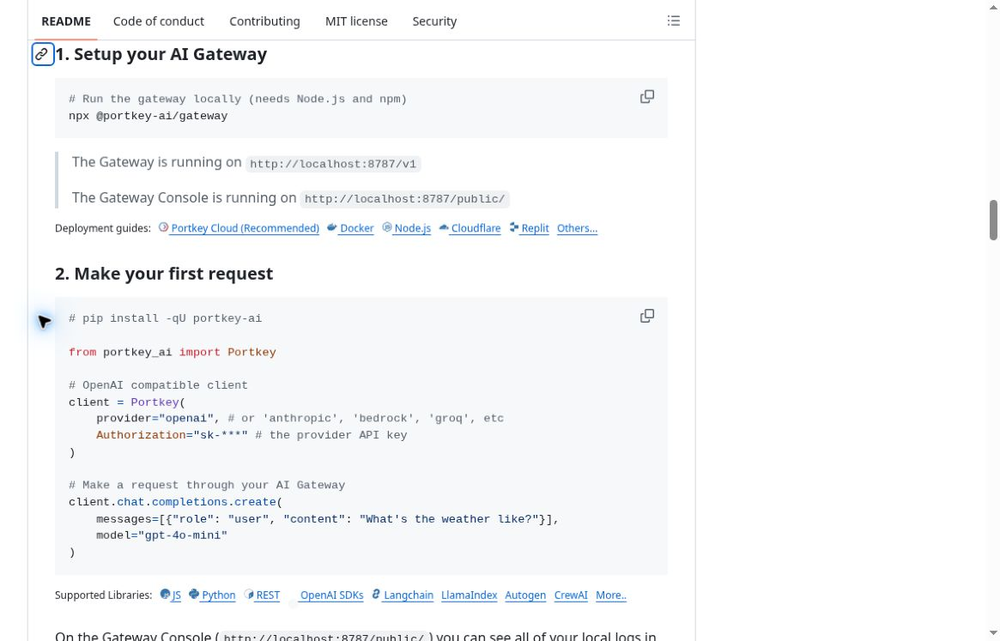
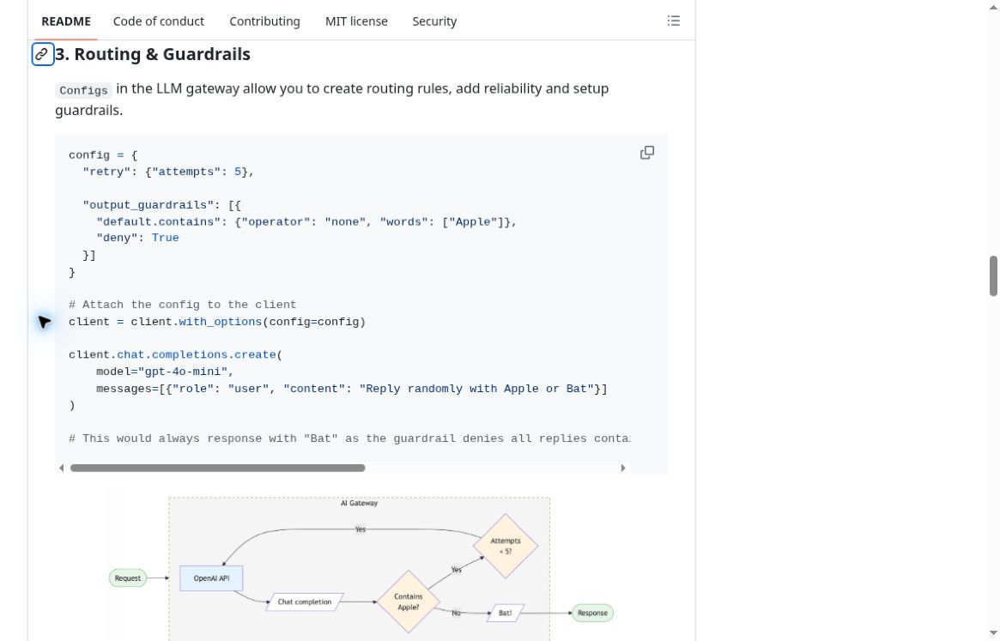
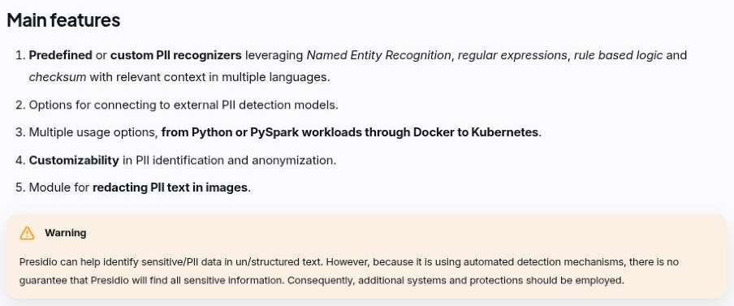
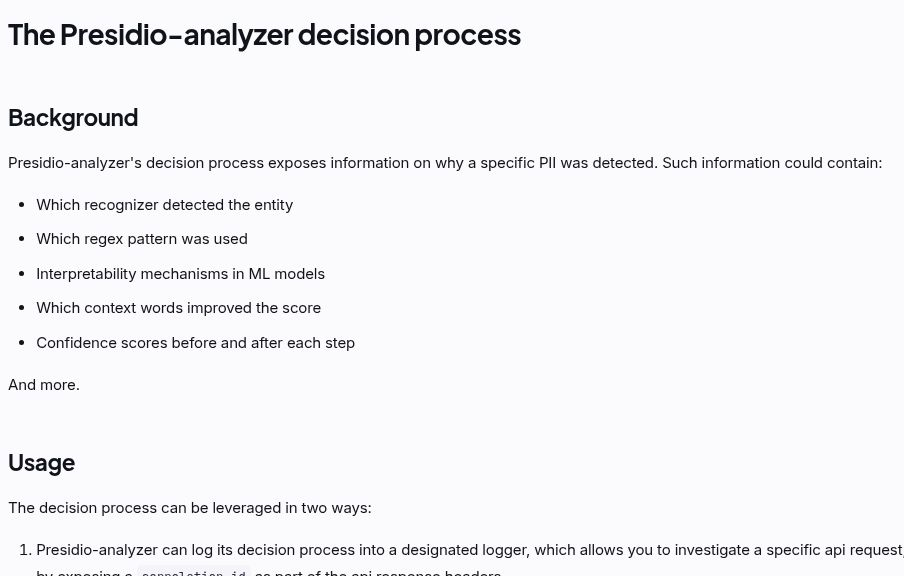
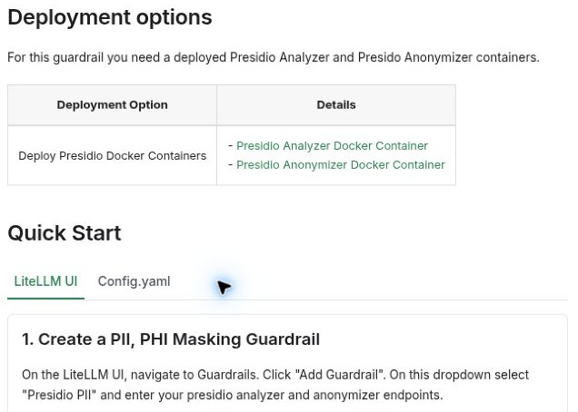
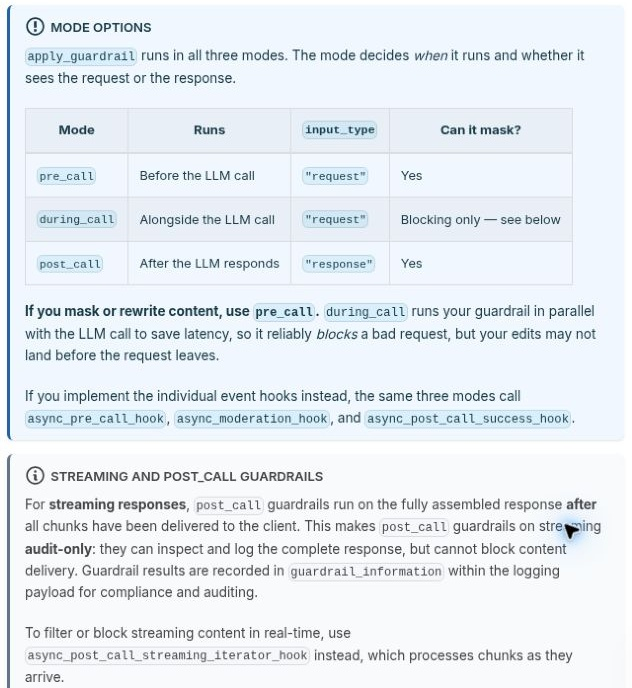
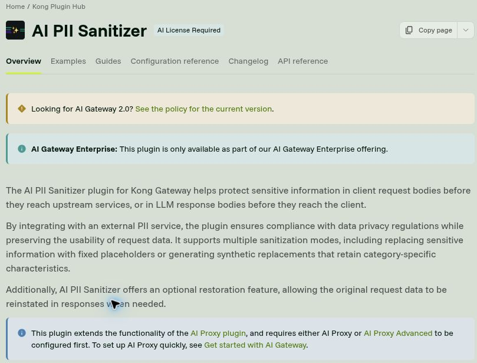
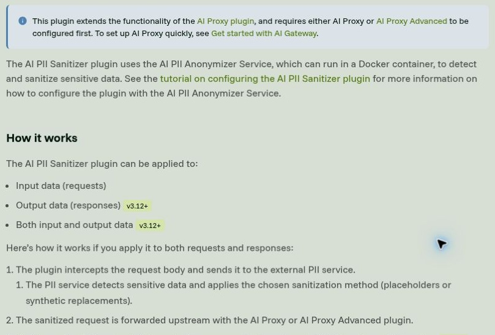
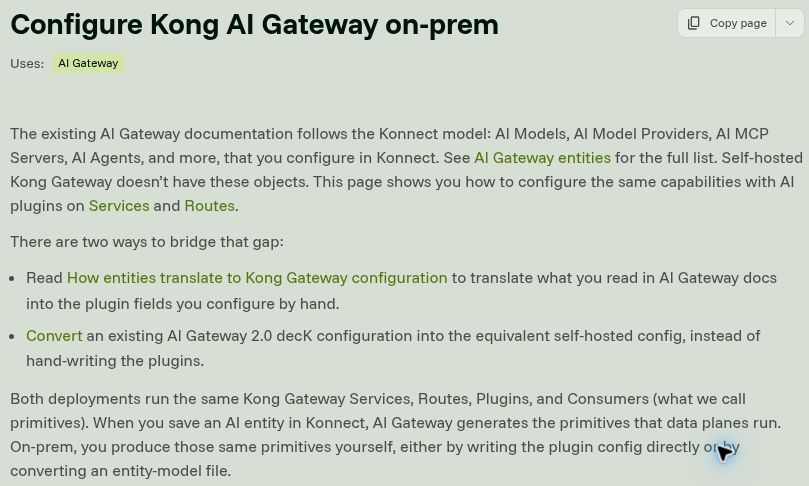

# Alternative analysis: documentation evidence gallery

Seven ALT-02–ALT-04 public-documentation screenshots were captured on **2026-09-30 (UTC)** according to their source package, restored unchanged and visually rechecked on **2026-10-03 (UTC)**. Two ALT-01 screenshots were captured directly from Portkey's MIT-licensed gateway README on **2026-10-03 (UTC)**. All nine establish documented capabilities and constraints, **not executed runtime tests**, measured performance or proof of compliance. No private account identity, personal data or real credentials appears in the images; the Portkey key text is the source's masked example.

This gallery contains at least two screenshots for each alternative. Source links and captions identify exactly what each screenshot supports. The three earlier Portkey product-docs crops were not republished because their separate documentation reuse license was unverified; the two gateway-README captures replace them with attributable evidence. They do not visually establish the separately cited PII redaction limitations.

## Evidence map

| Alternative | Properties / observations supported | Screenshots |
| --- | --- | --- |
| [ALT-01](../../docs/research/alternatives.md#alt-01-portkey-ai-gateway-direct-competitor) | P1/P3/P5; O1/O5 | Local setup/client, output guardrail/retry example |
| [ALT-02](../../docs/research/alternatives.md#alt-02-presidio-with-application-middleware-adjacent-substitute) | P2/P4/P6/P7; O1/O2/O5 | Features/warning, decision trace |
| [ALT-03](../../docs/research/alternatives.md#alt-03-litellm-proxy-with-presidio-open-source--self-hosted-competitor) | P2/P3/P5/P7; O2/O3 | Deployment dependencies, hook timing |
| [ALT-04](../../docs/research/alternatives.md#alt-04-kong-ai-gateway-on-prem-with-ai-pii-sanitizer-enterprise-competitor) | P2/P3/P5/P7; O1–O3 | License/sanitization, service flow, on-prem configuration |

Source owners retain rights in the documentation and product names shown; these excerpts are attributed Week 1 research evidence, not gateway7 product assets. See [attribution and reuse limits](../../ATTRIBUTION.md).

## ALT-01 — Portkey

### 01 — Local setup and provider client

- **Captured:** 2026-10-03 (UTC), directly in a browser; no product execution.
- **Source:** [Gateway README: Setup your AI Gateway](https://github.com/Portkey-AI/gateway#1-setup-your-ai-gateway), associated documentation covered by the [gateway MIT license](https://github.com/Portkey-AI/gateway/blob/main/LICENSE).
- **Visible evidence:** Local startup requires Node.js/npm; the README names local gateway and console endpoints and provides a Python OpenAI-compatible client example with a selected provider. The key shown is a masked documentation example, not a credential.
- **Interpretation:** ALT-01 O1, P1/P5: a documented local integration path exists, unlike building all provider interception around a standalone detector. No installation success, setup-time claim or production data boundary was tested.

### 02 — Output guardrail and retries

- **Captured:** 2026-10-03 (UTC), directly in a browser; no product execution.
- **Source:** [Gateway README: Routing and Guardrails](https://github.com/Portkey-AI/gateway#3-routing--guardrails), under the same retained MIT notice.
- **Visible evidence:** The example sets a retry count and an output rule that denies a response containing a chosen word, then attaches the configuration to a client call. Part of a request/retry flow diagram is visible; the code comment extends beyond the horizontal viewport.
- **Interpretation:** ALT-01 O5, P3: configurable response checks are documented. This example does not prove multi-turn request coverage, PII effectiveness or the behavior of every product edition.

## ALT-02 — Presidio

### 01 — Inspect detection capabilities and warning

- **Source:** [Presidio: Main features](https://presidio.dataprivacystack.org/#main-features)
- **Visible evidence:** Predefined/custom recognizers, NER, regex, rule-based logic, checksums, multiple languages, external detection models, Python/PySpark/Docker/Kubernetes usage, customizable identification/anonymization and image-text redaction. The warning explicitly says automated detection does not guarantee finding all sensitive information and additional protections are needed.
- **Interpretation:** A strong customizable engine is documented, but no zero-miss security guarantee is supported.

### 02 — Inspect decision traceability

- **Source:** [The Presidio-analyzer decision process](https://presidio.dataprivacystack.org/analyzer/decision_process/)
- **Visible evidence:** Explanations can identify the recognizer, regex, ML interpretability mechanism, contextual words and confidence changes. The beginning of the usage section describes logging the decision process to investigate a request. The bottom of this crop is cut off, so correlation-ID details are not legibly shown.
- **Interpretation:** Detection explanations are a documented building block for an audit trail. The linked source additionally describes request correlation, but that detail must not be attributed to this crop. This is not evidence of a complete gateway product or a deployed audit system.

## ALT-03 — LiteLLM + Presidio

### 01 — Configure dependency endpoints

- **Source:** [PII, PHI Masking — Presidio: Deployment options](https://docs.litellm.ai/docs/proxy/guardrails/pii_masking_v2#deployment-options)
- **Visible evidence:** The integration requires deployed Presidio Analyzer and Anonymizer containers. The UI setup instructions select Presidio PII and enter the analyzer/anonymizer endpoints.
- **Interpretation:** LiteLLM provides gateway integration while detection and anonymization depend on separately deployed services. This crop does not show or verify a running localhost endpoint.

### 02 — Select hook timing and inspect streaming limitations

- **Source:** [Custom Guardrail](https://docs.litellm.ai/docs/proxy/guardrails/custom_guardrail)
- **Visible evidence:** The mode table distinguishes pre-call, during-call and post-call. Pre-call is recommended for masking or rewriting; during-call edits may arrive too late. The streaming note says ordinary post-call checks run after chunks reach the client and are audit-only. A streaming-iterator hook is named for real-time chunk filtering/blocking.
- **Interpretation:** A non-streaming post-call check is not sufficient evidence of safe streaming interception. Hook selection is an important integration requirement.

## ALT-04 — Kong AI Gateway / AI PII Sanitizer

### 01 — Inspect product scope and licensing

- **Source:** [AI PII Sanitizer](https://developer.konghq.com/plugins/ai-sanitizer/)
- **Visible evidence:** An AI-license badge and enterprise-only notice are shown. The description covers request/response sanitization, placeholder or synthetic replacements and optional restoration. AI Proxy or AI Proxy Advanced must be configured first.
- **Interpretation:** Documented restoration is a differentiator, but licensing and prerequisite plugins constrain a student prototype. The source also points readers to a newer AI Gateway 2.0 policy; version-specific behavior needs checking.

### 02 — Inspect external-service flow

- **Source:** [AI PII Sanitizer](https://developer.konghq.com/plugins/ai-sanitizer/)
- **Visible evidence:** The AI PII Anonymizer Service can run in Docker. Input and output application is documented, with response/both modes marked v3.12+. The visible flow intercepts a request, passes it to an external PII service, then forwards the sanitized request using AI Proxy or AI Proxy Advanced.
- **Interpretation:** Deployment and privacy analysis must include that service boundary and the applicable Kong version.

### 03 — Configure on-prem primitives

- **Source:** [Configure Kong AI Gateway on-prem](https://developer.konghq.com/ai-gateway/configure-on-prem/)
- **Visible evidence:** Konnect uses higher-level AI entities absent from self-hosted Kong. The page describes configuring plugins on Services/Routes or converting an existing entity-model configuration. Both modes run Services, Routes, Plugins and Consumers; on-prem operators produce these primitives themselves.
- **Interpretation:** Self-hosting is documented, but it adds explicit configuration work. This is not proof that every Konnect capability has a self-hosted equivalent.

## Verification and limits

- All nine included JPEGs decode successfully and were visually checked against their captions. The seven restored images retain their source bytes; the two new Portkey images are direct browser captures. No evidence image was generated or retouched.
- Pixel inspection found no private identities or secrets. JPEG inspection found no EXIF metadata. Standard JPEG fields and, in three files, color profiles remain.
- The original eight documentation source pages and the replacement Portkey gateway README were accessible when checked on 2026-10-03. Public documentation can change; each image's capture date is recorded above.
- ALT-02-02 has a bottom-edge crop limitation. Its caption intentionally limits visible evidence to readable text.
- No effectiveness, false-negative rate, latency, cost, deployment success, or legal/compliance claim was independently tested here.
